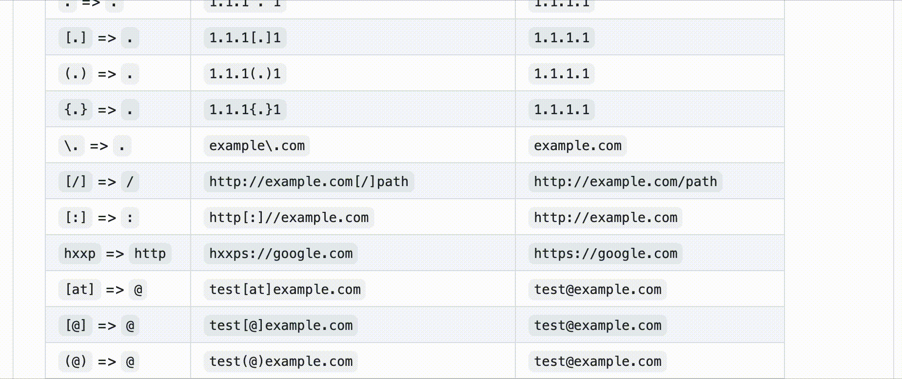
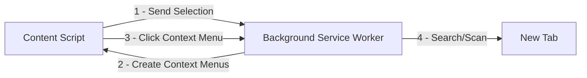

# Mitaka

[link-cws]: https://chrome.google.com/webstore/detail/mitaka/bfjbejmeoibbdpfdbmbacmefcbannnbg
[link-amo]: https://addons.mozilla.org/en-US/firefox/addon/mitaka/

Mitaka is a browser extension that makes your OSINT (Open Source Intelligence) search & scan easier.

- Key features:
  - Auto IoC (indicators of compromise) selection with refanging.
    - E.g. `example[.]com` to `example.com`, `test[at]example.com` to `test@example.com`, `hxxp://example.com` to `http://example.com`, etc.
  - Supports 65+ services.

## Install

 [][link-cws] [][link-cws]

 [][link-amo] [][link-amo]

## Features

### Supported IoCs (Indicators of Compromise)

| Name      | Desc.                       | E.g.                                         |
| :-------- | :-------------------------- | :------------------------------------------- |
| ANS       | ASN                         | `AS13335`                                    |
| BTC       | BTC address                 | `1A1zP1eP5QGefi2DMPTfTL5SLmv7DivfNa`         |
| CVE       | CVE number                  | `CVE-2018-11776`                             |
| Domain    | Domain name                 | `github.com`                                 |
| Email     | Email address               | `test@test.com`                              |
| ETH       | Ethereum address            | `0x32be343b94f860124dc4fee278fdcbd38c102d88` |
| GaPubID   | Google Adsense Publisher ID | `pub-9383614236930773`                       |
| GaTrackID | Google Analytics Tracker ID | `UA-67609351-1`                              |
| Hash      | MD5, SHA1, SHA256           | `44d88612fea8a8f36de82e1278abb02f`           |
| IP        | IPv4 address                | `8.8.8.8`                                    |
| URL       | URL                         | `https://github.com`                         |

### Supported Search Engines

| Name                 | URL                                    | Supported types                                                      |
| :------------------- | :------------------------------------- | :------------------------------------------------------------------- |
| AbuseIPDB            | https://www.abuseipdb.com              | IP                                                                   |
| AnyRun               | https://app.any.run                    | Hash                                                                 |
| apklab               | https://apklab.io                      | Hash (SHA256)                                                        |
| archive.org          | https://archive.org                    | URL                                                                  |
| archive.today        | http://archive.fo                      | URL                                                                  |
| BGPView              | https://bgpview.io                     | IP, ASN                                                              |
| BinaryEdge           | https://app.binaryedge.io              | IP, domain                                                           |
| BitcoinAbuse         | https://www.bitcoinabuse.com           | BTC                                                                  |
| Blockchain.com       | https://www.blockchain.com             | BTC                                                                  |
| Blockchair           | https://blockchair.com                 | BTC, ETH                                                             |
| BlockCypher          | https://live.blockcypher.com           | BTC                                                                  |
| Censys               | https://censys.io                      | IP, domain, ASN, email                                               |
| Checkphish           | https://checkphish.ai                  | IP, domain                                                           |
| Coalition            | https://ess.coalitioninc.com           | CVE                                                                  |
| crt.sh               | https://crt.sh                         | Domain                                                               |
| DNSlytics            | https://dnslytics.com                  | IP, domain                                                           |
| DNS Coffee           | https://dns.coffee                     | Domain                                                               |
| DomainTools          | https://www.domaintools.com            | IP, domain                                                           |
| EmailRep             | https://emailrep.io                    | Email                                                                |
| FileScan.IO          | https://filescan.io                    | Hash                                                                 |
| FortiGuard           | https://fortiguard.com                 | IP, URL, CVE                                                         |
| Google Safe Browsing | https://transparencyreport.google.com  | Domain, URL                                                          |
| GreyNoise            | https://viz.greynoise.io               | IP, domain, ASN, CVE                                                 |
| Host.io              | https://host.io                        | Domain                                                               |
| Hurricane Electric   | https://bgp.he.net/                    | IP, domain, ASN                                                      |
| HybridAnalysis       | https://www.hybrid-analysis.com        | IP, domain, hash                                                     |
| Intezer              | https://analyze.intezer.com            | Hash                                                                 |
| IPinfo               | https://ipinfo.io                      | IP, ASN                                                              |
| IPIP                 | https://en.ipip.net                    | IP, ASN                                                              |
| Joe Sandbox          | https://www.joesandbox.com             | Hash                                                                 |
| MalShare             | https://malshare.com                   | Hash                                                                 |
| Maltiverse           | https://www.maltiverse.com             | Domain, hash                                                         |
| MalwareBazaar        | https://bazaar.abuse.ch                | Hash                                                                 |
| Malwares             | https://www.malwares.com               | Hash                                                                 |
| NVD                  | https://nvd.nist.gov                   | CVE                                                                  |
| OOCPR                | https://data.occrp.org                 | Email                                                                |
| ONYPHE               | https://www.onyphe.io                  | IP                                                                   |
| OpenTIP              | https://opentip.kaspersky.com          | Hash                                                                 |
| OTX                  | https://otx.alienvault.com             | IP, domain, CVE, URL, hash                                           |
| Pulsedive            | https://pulsedive.com                  | IP, domain, URL, hash                                                |
| Radar                | https://radar.cloudflare.com           | IP, domain                                                           |
| RiskIQ               | http://community.riskiq.com            | IP, domain, email, Google Analytics Tracker ID                       |
| Robtex               | https://www.robtex.com                 | IP, domain                                                           |
| Scumware             | https://www.scumware.org               | IP, domain, hash (MD5)                                               |
| SecurityTrails       | https://securitytrails.com             | IP, domain                                                           |
| Shodan               | https://www.shodan.io                  | IP, domain, ASN                                                      |
| Sploitus             | https://sploitus.com                   | CVE                                                                  |
| SpyOnWeb             | http://spyonweb.com                    | IP, domain, Google Adsense Publisher ID, Google Analytics Tracker ID |
| Talos                | https://talosintelligence.com          | IP, domain                                                           |
| ThreatBook           | https://threatbook.io                  | IP, domain                                                           |
| ThreatConnect        | https://app.threatconnect.com          | IP, domain, email                                                    |
| ThreatMiner          | https://www.threatminer.org            | IP, domain, hash                                                     |
| TIP                  | https://threatintelligenceplatform.com | IP, domain                                                           |
| Triage               | https://tria.ge                        | Hash, URL                                                            |
| URLhaus              | https://urlhaus.abuse.ch               | IP, domain                                                           |
| urlscan.io           | https://urlscan.io                     | IP, domain, ASN, URL                                                 |
| URLVoid              | https://www.urlvoid.com                | Domain                                                               |
| ViewDNS              | https://viewdns.info                   | IP, domain, email                                                    |
| VirusTotal           | https://www.virustotal.com             | IP, domain, URL, hash                                                |
| VMRay                | https://www.vmray.com                  | Hash                                                                 |
| Vulmon               | https://vulmon.com                     | CVE                                                                  |
| WebCheck             | https://web-check.xyz                  | Domain                                                               |
| X-Force Exchange     | https://exchange.xforce.ibmcloud.com   | IP, domain, hash                                                     |
| ZoomEye              | https://www.zoomeye.org                | IP                                                                   |

### Supported Scan Engines

| name           | url                             | supported types |
| :------------- | :------------------------------ | :-------------- |
| Browserling    | https://www.browserling.com     | URL             |
| HybridAnalysis | https://www.hybrid-analysis.com | URL             |
| urlscan.io     | https://urlscan.io              | IP, domain, URL |
| VirusTotal     | https://www.virustotal.com      | URL             |

## How To Use

- [Use Mitaka to Perform In-Browser OSINT to Identify Malware, Sketchy Sites, Shady Emails & More](https://null-byte.wonderhowto.com/how-to/use-mitaka-perform-browser-osint-identify-malware-sketchy-sites-shady-emails-more-0216352/)

**Note:** Please set your API keys in the options for enabling HybridAnalysis, urlscan.io and VirusTotal scans.

## Options

You can enable/disable a search engine on the options page based on your preference.

> [!NOTE]
> Basic preferences are stored in [storage.sync](https://developer.chrome.com/docs/extensions/reference/api/storage). Thus they will be synced across devices.
> But API keys are stored in `storage.local`. You have to set API keys per device.

## Permissions

> [!NOTE]
> I don't and will never collect any information from the users. You can verify it by reviewing the source code.

### Firefox

Please allow "Access your data for all websites" permission. Otherwise this extension does not work.

## Privacy Policy

- [Privacy policy for the extension](https://ninoseki.github.io/chrome-webstore/privacy-policy/)

## Common Questions

- Q. The context menu is not displayed.
  - A. Sometimes it takes a while for the context menus to appear. Or something goes wrong while refreshing the context menus. This glitch can be solved by waiting for a second. Please take a breath after selecting and then right-click.

## Alternatives or Similar Tools

- [CrowdScrape](https://chrome.google.com/webstore/detail/crowdscrape/jjplaeklnlddpkbbdbnogmppffokemej)
- [Gotanda](https://github.com/HASH1da1/Gotanda)
- [SOC Multi-tool](https://github.com/zdhenard42/SOC-Multitool)
- [Sputnik](https://github.com/mitchmoser/sputnik)
- [ThreatConnect Integrated Chrome Extension](https://chrome.google.com/webstore/detail/threatconnect-integrated/lblgcphpihpadjdpjgjnnoikjdjcnkbh)
- [ThreatPinch Lookup](https://github.com/cloudtracer/ThreatPinchLookup)
- [VTchromizer](https://chrome.google.com/webstore/detail/vtchromizer/efbjojhplkelaegfbieplglfidafgoka)

## How It Works

## Contribute

Read the [contribution guide](contributing.md) and join the [contributors](https://github.com/ninoseki/mitaka/graphs/contributors).
