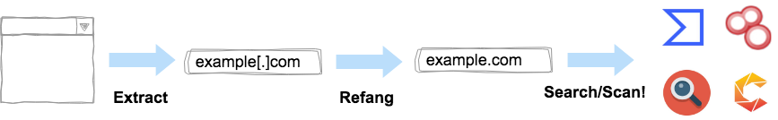

# Mitaka

[](https://chrome.google.com/webstore/detail/mitaka/bfjbejmeoibbdpfdbmbacmefcbannnbg)
[](https://addons.mozilla.org/en-US/firefox/addon/mitaka/)
[](https://chrome.google.com/webstore/detail/mitaka/bfjbejmeoibbdpfdbmbacmefcbannnbg)
[](https://chrome.google.com/webstore/detail/mitaka/bfjbejmeoibbdpfdbmbacmefcbannnbg)
[](https://travis-ci.org/ninoseki/mitaka)
[](https://www.codefactor.io/repository/github/ninoseki/mitaka)
[](https://coveralls.io/github/ninoseki/mitaka)



Mitaka is a browser extension for OSINT search which can:

- Extract & refang IoC from a selected block of text.
  - E.g. `example[.]com` to `example.com`, `test[at]example.com` to `test@example.com`, `hxxp://example.com` to `http://example.com`, etc.
- Search / scan it on various engines.
  - E.g. VirusTotal, urlscan.io, Censys, Shodan, etc.

## Features

### Supported IOC types

| name      | desc.                       | e.g.                                 |
|:----------|:----------------------------|:-------------------------------------|
| text      | Freetext                    | any string(s)                        |
| ip        | IPv4 address                | `8.8.8.8`                            |
| domain    | Domain name                 | `github.com`                         |
| url       | URL                         | `https://github.com`                 |
| email     | Email address               | `test@test.com`                      |
| asn       | ASN                         | `AS13335`                            |
| hash      | md5 / sha1 / sha256         | `44d88612fea8a8f36de82e1278abb02f`   |
| cve       | CVE number                  | `CVE-2018-11776`                     |
| btc       | BTC address                 | `1A1zP1eP5QGefi2DMPTfTL5SLmv7DivfNa` |
| gaPubID   | Google Adsense Publisher ID | `pub-9383614236930773`               |
| gaTrackID | Google Analytics Tracker ID | `UA-67609351-1`                      |

### Supported search engines

| name                 | url                                    | supported types                   |
|:---------------------|:---------------------------------------|:----------------------------------|
| AbuseIPDB            | https://www.abuseipdb.com              | ip                                |
| Apility              | https://apility.io                     | ip / domain / email / asn         |
| archive.org          | https://archive.org                    | url                               |
| archive.today        | http://archive.fo                      | url                               |
| BGPView              | https://bgpview.io                     | ip / asn                          |
| BinaryEdge           | https://app.binaryedge.io              | ip / domain                       |
| BitcoinAbuse         | https://www.bitcoinabuse.com           | btc                               |
| Blockchain.com       | https://www.blockchain.com             | btc                               |
| BlockCypher          | https://live.blockcypher.com           | btc                               |
| Censys               | https://censys.io                      | ip / domain / asn / text          |
| crt.sh               | https://crt.sh                         | domain                            |
| DNSlytics            | https://dnslytics.com                  | ip / domain                       |
| DomainBigData        | https://domainbigdata.com              | domain                            |
| DomainTools          | https://www.domaintools.com            | ip / domain                       |
| DomainWatch          | https://domainwat.ch                   | domain / email                    |
| EmailRep             | https://emailrep.io                    | email                             |
| FindSubDomains       | https://findsubdomains.com             | domain                            |
| FOFA                 | https://fofa.so                        | ip / domain                       |
| FortiGuard           | https://fortiguard.com                 | ip / url / cve                    |
| Google Safe Browsing | https://transparencyreport.google.com  | domain / url                      |
| GreyNoise            | https://viz.greynoise.io               | ip / domain / asn                 |
| Hashdd               | https://hashdd.com                     | ip / domain / hash                |
| HybridAnalysis       | https://www.hybrid-analysis.com        | ip / domain / hash (sha256 only)  |
| Intelligence X       | https://intelx.io                      | ip / domain / url / email / btc   |
| IPinfo               | https://ipinfo.io                      | ip / asn                          |
| IPIP                 | https://en.ipip.net                    | ip / asn                          |
| Joe Sandbox          | https://www.joesandbox.com             | hash                              |
| MalShare             | https://malshare.com                   | hash                              |
| Maltiverse           | https://www.maltiverse.com             | domain / hash                     |
| NVD                  | https://nvd.nist.gov                   | cve                               |
| OOCPR                | https://data.occrp.org                 | email                             |
| ONYPHE               | https://www.onyphe.io                  | ip                                |
| OTX                  | https://otx.alienvault.com             | ip / domain / hash                |
| PubDB                | http://pub-db.com                      | gaPubID / gaTrackID               |
| PublicWWW            | https://publicwww.com                  | text                              |
| Pulsedive            | https://pulsedive.com                  | ip / domaion / url / hash         |
| RiskIQ               | http://community.riskiq.com            | ip / domain / email / gaTrackID   |
| SecurityTrails       | https://securitytrails.com             | ip / domain / email               |
| Shodan               | https://www.shodan.io                  | ip / domain / asn                 |
| Sploitus             | https://sploitus.com                   | cve                               |
| SpyOnWeb             | http://spyonweb.com                    | ip / domain / gaPubID / gaTrackID |
| Talos                | https://talosintelligence.com          | ip / domain                       |
| ThreatConnect        | https://app.threatconnect.com          | ip / domain / email               |
| ThreatCrowd          | https://www.threatcrowd.org            | ip / domain / email               |
| ThreatMiner          | https://www.threatminer.org            | ip / domain / hash                |
| TIP                  | https://threatintelligenceplatform.com | ip / domain                       |
| Urlscan              | https://urlscan.io                     | ip / domain / asn / url           |
| ViewDNS              | https://viewdns.info                   | ip / domain / email               |
| VirusTotal           | https://www.virustotal.com             | ip / domain / url / hash          |
| Vulmon               | https://vulmon.com                     | cve                               |
| VulncodeDB           | https://www.vulncode-db.com            | cve                               |
| VxCube               | http://vxcube.com                      | ip / domain / hash                |
| WebAnalyzer          | https://wa-com.com                     | domain                            |
| We Leak Info         | https://weleakinfo.com                 | email                             |
| X-Force Exchange     | https://exchange.xforce.ibmcloud.com   | ip / domain / hash                |
| ZoomEye              | https://www.zoomeye.org                | ip                                |

### Supported scan engines

| name       | url                        | supported types   |
|:-----------|:---------------------------|:------------------|
| Urlscan    | https://urlscan.io         | ip / domain / url |
| VirusTotal | https://www.virustotal.com | url               |

## Downloads

- Chrome: https://chrome.google.com/webstore/detail/mitaka/bfjbejmeoibbdpfdbmbacmefcbannnbg
- FireFox: https://addons.mozilla.org/en-US/firefox/addon/mitaka/

## How to use

This browser extension shows context menus based on a type of IoC you selected and then you can choose what you want to search / scan on.

**Examples:**


---


**Note:**

Please set your urlscan.io & VirusTotal API keys in the options page for enabling urlscan.io & VirusTotal scans.

## Options

You can enable / disable a search engine on the options page based on your preference.


## About Permissons

This browser extension requires the following permissions.

- `Read and change all your data on the websites you visit`:
  - This extension creates context menus dynamically based on what you select on a website.
  - It means this extension requires reading all your data on the websites you visit. (This extension doesn't change anything on the websites)
- `Display notifications`:
  - This extension makes a notification when something goes wrong.

I don't (and will never) collect any information from the users.

## Alternatives or Similar Tools

- [CrowdScrape](https://chrome.google.com/webstore/detail/crowdscrape/jjplaeklnlddpkbbdbnogmppffokemej)
- [Gotanda](https://github.com/HASH1da1/Gotanda)
- [Sputnik](https://github.com/mitchmoser/sputnik)
- [ThreatConnect Integrated Chrome Extension](https://chrome.google.com/webstore/detail/threatconnect-integrated/lblgcphpihpadjdpjgjnnoikjdjcnkbh)
- [ThreatPinch Lookup](https://github.com/cloudtracer/ThreatPinchLookup)
- [VTchromizer](https://chrome.google.com/webstore/detail/vtchromizer/efbjojhplkelaegfbieplglfidafgoka)

## How to build (for developers)

This browser extension is written in [TypeScript](https://www.typescriptlang.org/) and built by [webpack](https://webpack.js.org/).

TypeScript files will start out in `src` directory, run through the TypeScript compiler, then webpack, and end up in JavaScript files in `dist` directory.

```sh
git clone https://github.com/ninoseki/mitaka.git
cd mitaka
npm install
npm run test
npm run build
```

For loading an unpacked extension, please follow the procedures described at https://developer.chrome.com/extensions/getstarted.

## Misc

Mitaka/見たか means "Have you seen it?" in Japanese.
